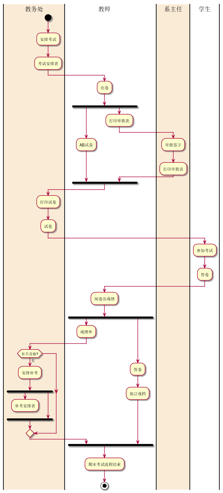
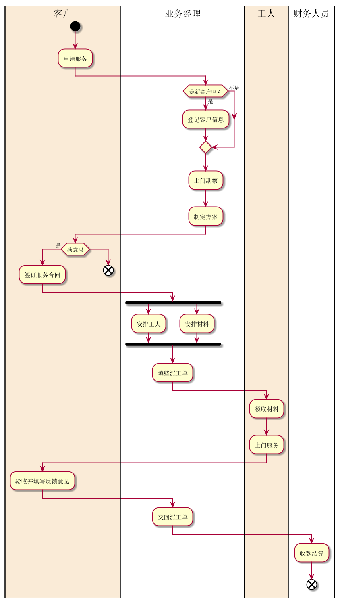

# 实验一 业务流程建模

#### 学号：201710414204  班级：17软件工程2班   姓名：何娟

----------------
### 1.1 PlantUML源码（考试及成绩管理流程图）如下：
<pre>
<code>
@startuml
|教务处|
start
:安排考试;
:考试安排表;
|教师|
:出卷;
fork
    :AB试卷;
fork again
    :打印审批表;
    |#AntiqueWhite|系主任|
    :审批签字;
    :打印审批表;
    |教师|
end fork
    |#AntiqueWhite|教务处|
    :打印试卷;
    :试卷;
    |学生|
    :参加考试;
    :答卷;
    |教师|
    :阅卷出成绩;
    fork
        :成绩单;
        |教务处|
       if (有不及格?) then (有)
        :安排补考;
        fork
        :补考安排表;
        detach
       fork again
       end fork
        endif
fork again
      |教师|
      :答卷;
      :装订成档;
    end fork
:期末考试流程结束;
stop
@enduml
</code></pre>

 

## 1.1.1 考试及成绩管理流程图

### 1.1.2 流程说明
 
期末考试活动图的绘制主要运用了泳道，并行，条件，判断等语法，在制图的过程需要注意的就是
活动之间的逻辑思维，合理选择运用每个语法。特别需要注意的是并行和选择的结束位置，因为不同的
结束位置决定图的走向。比如再此图中成绩单流程后面的条件的结束点就特别重要。同时还需要特别注意并行的嵌套，
实现并行的嵌套语法也很简单，但是必须要有完整的fork结构，即fork--fork again --end fork。同时条件语句也必须要有完整的语句结构。
 

### 1.2 PlantUML源码（客户维修服务流程图）如下：
<pre>
<code>
@startuml
|#AntiqueWhite|客户|
start
:申请服务;
|业务经理|
if (是新客户吗？) then(是)
:登记客户信息;
else (不是)
endif
:上门勘察;
:制定方案;
|客户|
if (满意吗) then (是)
:签订服务合同;
|业务经理|
fork
:安排工人;
fork again
:安排材料;
end fork
:填些派工单;
|#AntiqueWhite|工人|
:领取材料;
:上门服务;
|客户|
:验收并填写反馈意见;
|业务经理|
:交回派工单;
|财务人员|
:收款结算;
end
else
|客户|
end
@enduml
</code>
</pre>
### 1.2.1 客户维修服务流程图

### 1.2.2 制图说明
 
施工图的总体逻辑结果较为简单只需要注意几个并行与选择的起始就可以了，语法也简单。
 

