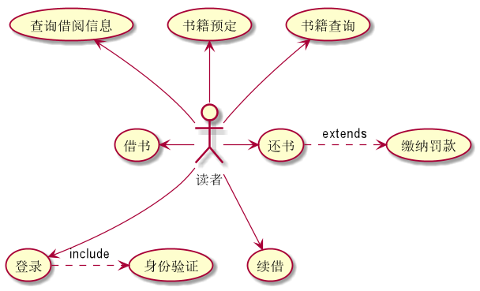
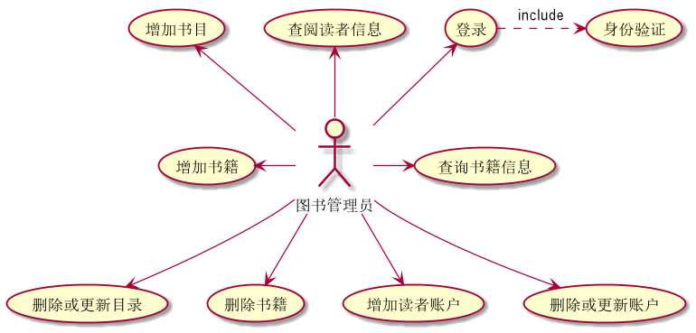
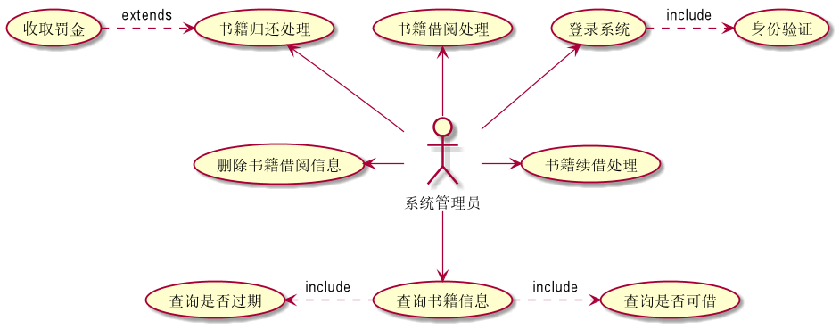

# 实验二 图书馆管理系统用例建模

#### 学号：201710414204  班级：17软件工程2班   姓名：何娟

----------------
### 1.1 PlantUML源码（读者）如下：
<pre>
<code>
@startuml
:读者: --> (登录)
:读者:-up-> (书籍查询)
:读者:-up-> (书籍预定)
:读者:-up-> (查询借阅信息)
:读者:-left-> (借书)
:读者: -down-> (续借)
:读者: -right-> (还书)
(还书) .>(缴纳罚款) : extends
(登录) .>(身份验证) : inchulde
@enduml
</code></pre>

 

## 1.1.1 读者用例图

### 1.1.2 读者参与者用例说明
 
读者参与者可以实现的功能：     

1.登录系统  
2.书籍查询： 无论是读者，还是系统管理员还是图书管理员都应该可以查询书籍的信息，查询书籍是否可借，库存等信息。  
3.书籍预定：读者在查询了书籍信息之后可以预定图书，这样就不会出现借不到书的情况。   
4.查询借阅信息：读者可以登录系统，查看自己的借阅信息。  
5.借书：读者可以借阅系统内显示还有余量的书籍。  
6.还书：读者登录系统，进入个人中心后，在相应的书后点击归还，即可还书，待还书成功后，系统余量加一。  
7.续借:借阅期未满，但是在书籍并未完全看完的情况下可以续借。
 
### 1.1.3 用例规约图(下方链接)
[读者参与者用例规约表](./usecase1.md)

### 1.2 PlantUML源码（图书管理员）如下：
<pre>
<code>
@startuml

:图书管理员: -up-> (登录)
:图书管理员: -up-> (查阅读者信息)
:图书管理员: -right-> (查询书籍信息)
:图书管理员: -down-> (删除或更新目录)
:图书管理员: -up-> (增加书目)
:图书管理员: -left-> (增加书籍)
:图书管理员: -down-> (删除书籍)
:图书管理员: -down-> (增加读者账户)
:图书管理员: -down-> (删除或更新账户)
(登录) .>(身份验证) : include
@enduml
</code>
</pre>
### 1.2.1 图书管理员用例图

### 1.2.2 图书管理员参与者用例说明
 

图书管理员参与者可以实现的功能：     

1.登录系统：图书管理员通过自己已有的账号和密码登录进入图书管理系统。  
2.查询读者信息：图书管理员拥有查看系统所有读者的权限。  
3.查询书籍信息：无论是读者，还是系统管理员还是图书管理员都应该可以查询书籍的信息，查询书籍是否可借，库存等信息。  
4.增加读者账户：读者可以通过在图书管理员处，申请用户账号，管理员直接在管理员界面进行增加读者操作。  
5.删除或更新账户：读者可以通过在图书管理员处，注销或者修改账户信息，图书管理员 在系统内进行账号的删除和更新。  
6.删除书籍：图书馆会定期的更新书籍，对老旧书籍进行删除，或者对实际不存在的图书进行删除。  
7.删除或更新目录：图书管理员可以对现有书目进行删除和更新。  
8.增加书籍：图书馆会定期增加新书或者增加已有书籍的数量，而在系统上则由图书管理员进行相应的操作。  
9.增加书目：图书管理员可以对未有书目进行增加。
 

### 1.2.3 用例规约图（下方链接）
[图书管理员参与者用例规约表](./usecase2.md)

### 1.3 PlantUML源码（系统管理员用例）如下：
<pre>
<code>
@startuml

:系统管理员: -up-> (登录系统)
:系统管理员: -up-> (书籍借阅处理)
:系统管理员: -up-> (书籍归还处理)
:系统管理员: -right-> (书籍续借处理)
:系统管理员: -down-> (查询书籍信息)
:系统管理员: -left-> (删除书籍借阅信息)
(登录系统) .>(身份验证) : include
(收取罚金) .>(书籍归还处理) : extends
(查询书籍信息) -left.>(查询是否过期) : include
(查询书籍信息) .>(查询是否可借) : include

@enduml
</code>
</pre>
### 1.3.1 系统管理员用例图

### 1.3.2 系统管理员参与者用例说明
 
系统管理员参与者可以实现的功能：     

1.登录系统：系统管理员通过自己已有的账号和密码登录进入图书管理系统。  
2.书籍归还处理：读者在归还相应的书籍是，系统管理员角色应该判断其是否逾期归还判断是否需要缴纳罚金
3.书籍借阅处理：系统管理员书籍借阅信息的处理权限。  
4.删除书籍借阅信息：由于图书管理系统每天产生的数据量较大，若不及时进行相应处理，或导致系统的卡崩等等问题，所以系统管理员需要在后台及时清除过时的借阅信息。
5.查询书籍信息：无论是读者，还是系统管理员还是图书管理员都应该可以查询书籍的信息，查询书籍是否可借，库存等信息。  
6.书籍续借处理：在读者选择续借之后，系统管理员在后台对相应的图书信息进行操作。  
 

### 1.3.3 用例规约图（下方链接）
[系统管理员参与者用例规约表](./usecase3.md)

## 1.4 实验心得
 
这次实验的主要内容是系统用例建模，通过实验取得以下心得：   
   
1.通过本次实验掌握了plantUml中用例图的语法，并且在实验过程中发现用例图的整体语法会比活动图简单些。   
2.在画用例图的过程我发现在设置用例与参与者的箭头方向的时候发现，left和right只能使用一次，而up和down可以多次使用。  
3.同时通过本次实验我更了解了用例图的存在意义，用例图可以帮助开发的思路更加明确，清楚的知道系统具有的功能，以及哪些应该具有哪些功能，可以大大提高开发的效率。  
 

