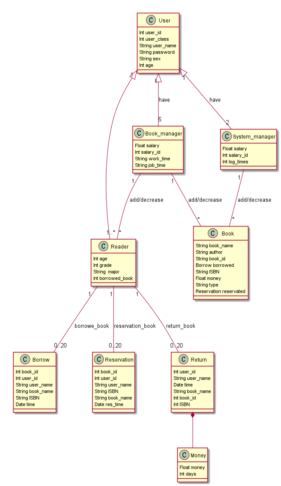
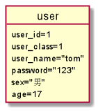
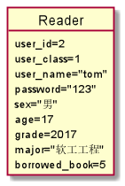
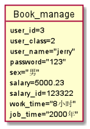
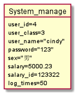
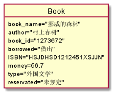
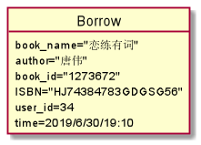
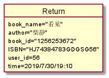
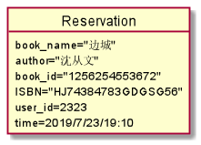
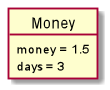

# 实验3：图书管理系统领域对象建模
班级：17软工2班    学号：201710414204   姓名：何娟
## 1.图书管理系统的类图
#### 1.1 图书馆系统类图PlantUml代码
<pre>
<code>
@startuml
class User {
    Int user_id
    Int user_class
    String user_name
    String password
    String sex
    Int age
}
class Reader{
    Int age
    Int grade
    String  major
    Int borrowed_book
}
class Book_manager{
    Float salary
    Int salary_id
    String work_time
    String job_time
}
class System_manager{
    Float salary
    Int salary_id
    Int log_times
}

class Book {
    String book_name
    String author
    String book_id
    Borrow borrowed
    String ISBN
    Float money
    String type
    Reservation reservated
}
class Borrow{
    Int book_id
    Int user_id
    String user_name
    String book_name
    String ISBN
    Date time
}
class Reservation{
    Int book_id
    Int user_id
    String user_name
    String ISBN
    String book_name
    Date res_time
}
class Return{
    Int user_id
    String user_name
    Date time
    String book_name
    Int book_id
    Int ISBN
}
class Money{
    Float money
    Int days
}
User "1" <|-- "1..*" Reader
User "1" <|-- "5" Book_manager:have
User "1" <|-- "2" System_manager:have
Reader "1" -- "0..20" Borrow:borrowe_book
Reader "1" -- "0..20" Reservation:reservation_book
Reader "1" -- "0..20" Return:return_book
Book_manager"1" -- "*" Book:add/decrease
System_manager "1" -- "*" Book:add/decrease
Book_manager "1" -- "*" Reader:add/decrease
Return *-- Money
@enduml
</code>
</pre>
#### 1.2 类图如下：

#### 1.4 类图说明：
 
1.User类：包括用户ID，用户名，用户密码，用户级别等信息，不同的用户级别代表不同的用户身份，而具体的用户身份可以分为一班用户，图书管理员，系统管理员。    

2.Reader类：继承自User类，包含User类中所有的属性同时还有专业，年级等信息。  
3.Book_manager类：继承自User类，一个图书管理系统有5个图书管理员，包含User类中所有的属性同时还有上班时间，工资号，入职时间等信息。  
4.System_manager类：继承自User类，一个图书管理系统有2个系统管理员，包含User类中所有的属性同时还有登录系统次数，工资号等信息。  
5.Book类：图书类，包含书籍名称，作者，ID，ISBN，价格，是否被约等信息，图书管理员与系统管理员可以直接对其操作，增加删除修改图书信息。  
6.Return类：还书类，包含读者ID，读者姓名，还书时间，还书名称等信息，一个用户一次至多可以还20本书。  
7.Borrow类：借书类，包含读者ID，读者姓名，还书时间，借书名称等信息，一个用户一次至多可以借20本书。  
8.Reservations类：预定类，包含读者ID，读者姓名，还书时间，预定书籍名称等信息，一个用户一次至多可以预定20本书。   
9.Money类：罚款类，包括罚金和逾期天数属性，罚款金额根据逾期天数而定。 
 
## 2.图书管理系统的对象图
#### 2.1 类User的对象图
源码如下：
<pre>
<code>
@startuml
object user {
    user_id=1
    user_class=1
    user_name="tom"
    password="123"
    sex="男"
    age=17
}
@enduml
</code>
</pre>
对象图如下：

#### 2.2 类Reader的对象图
源码如下：
<pre>
<code>
@startuml
object Reader {
    user_id=2
    user_class=1
    user_name="tom"
    password="123"
    sex="男"
    age=17
    grade=2017
    major="软工工程"
    borrowed_book=5
}
@enduml
</code>
</pre>
对象图如下：

#### 2.3 类Book_manage的对象图
源码如下：
<pre>
<code>
@startuml
object Book_manage {
    user_id=2
    user_class=1
    user_name="tom"
    password="123"
    sex="男"
    age=17
    grade=2017
    major="软工工程"
    borrowed_book=5
    salary=5000.23
    salary_id=123322
    work_time="8小时"
    job_time="2000年"
}
@enduml
</code>
</pre>
对象图如下：

#### 2.4 类System_manage的对象图
源码如下：
<pre>
<code>
@startuml
object System_manage {
    user_id=4
    user_class=3
    user_name="cindy"
    password="123"
    sex="男"
    salary=5000.23
    salary_id=123322
    log_times=50
}
@enduml
</code>
</pre>
对象图如下：

#### 2.5 类Book的对象图
源码如下：
<pre>
<code>
@startuml
object Book {
    book_name="挪威的森林"
    author="村上春树"
    book_id="1273672"
    borrowed="借出"
    ISBN="HSJDHSD1212451XSJJN"
    money=56.7
    type="外国文学"
    reservated="未预定"
}
@enduml
</code>
</pre>
对象图如下：

#### 2.6 类Borrowe(借书)的对象图
源码如下：
<pre>
<code>
@startuml
object Borrow {
    book_name="恋练有词"
    author="唐伟"
    book_id="1273672"
    ISBN="HJ74384783GDGSG56"
    user_id=34
    time=2019/6/30/19:10
}
@enduml
</code>
</pre>
对象图如下：

#### 2.7 类Return(还书)的对象图
源码如下：
<pre>
<code>
@startuml
object Return {
    book_name="看见"
    author="柴静"
    book_id="1256253672"
    ISBN="HJ74384783GDGSG56"
    user_id=56
    time=2019/7/30/19:10
}
@enduml
</code>
</pre>
对象图如下：

#### 2.8 类Reservation(预定)的对象图
源码如下：
<pre>
<code>
@startuml
object Reservation {
    book_name="边城"
    author="沈从文"
    book_id="1256254553672"
    ISBN="HJ74384783GDGSG56"
    user_id=2323
    time=2019/7/23/19:10
}
@enduml
</code>
</pre>
对象图如下：

#### 2.9 类Money的对象图
源码如下：
<pre>
<code>
@startuml
object Money {
    money = 1.5
    days = 3
}
@enduml
</code>
</pre>
对象图如下：

