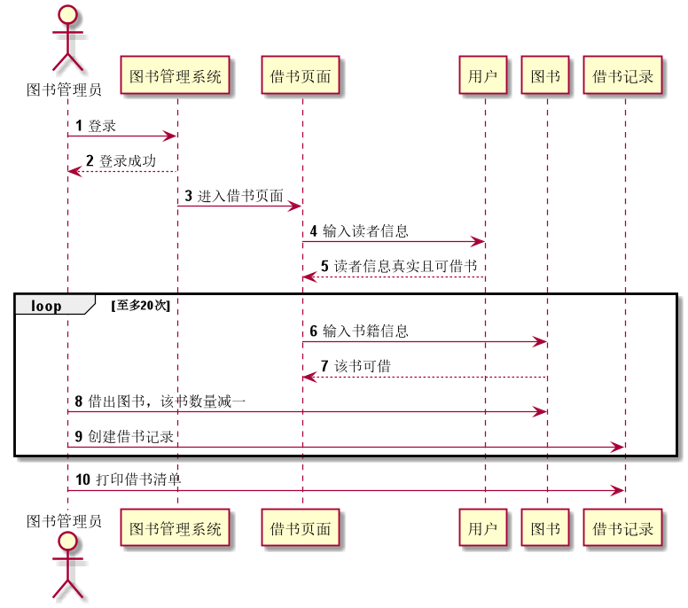
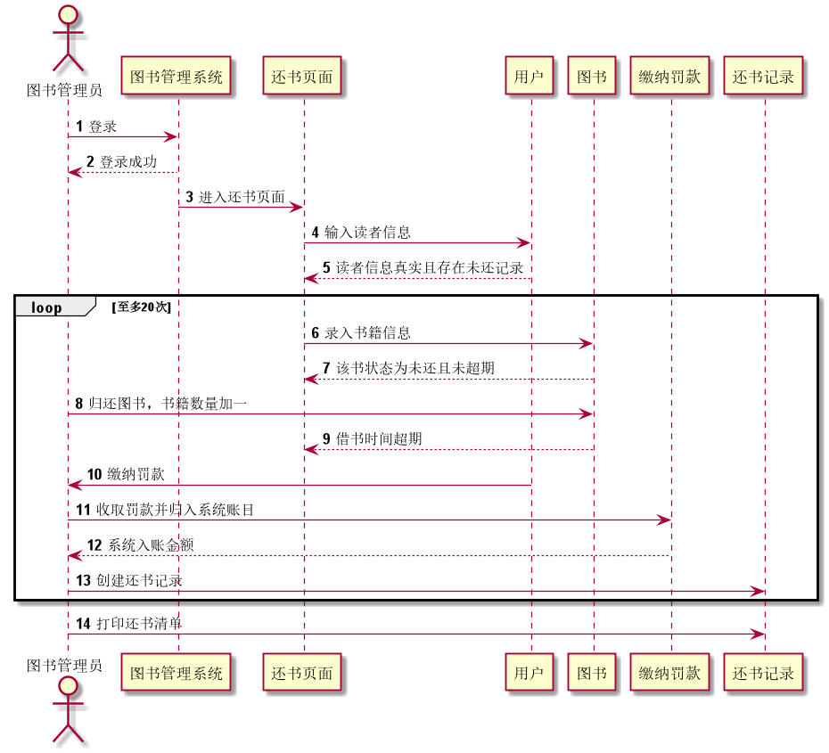
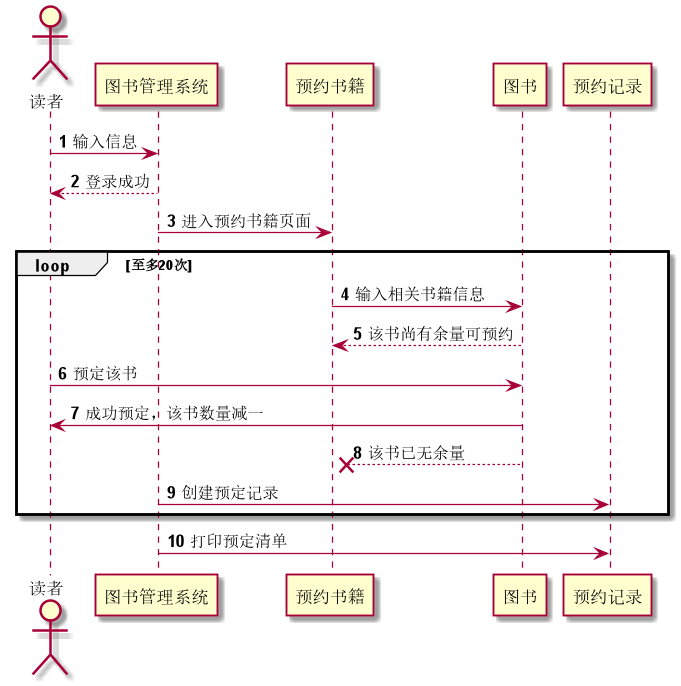
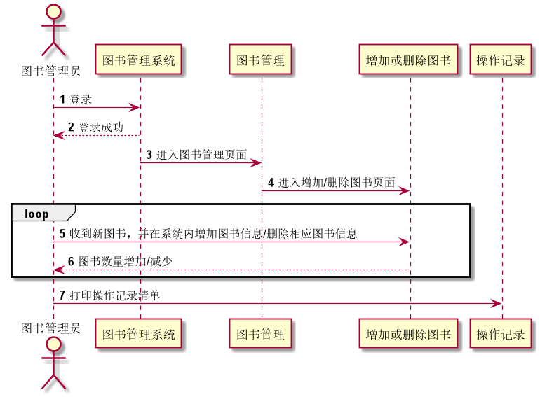
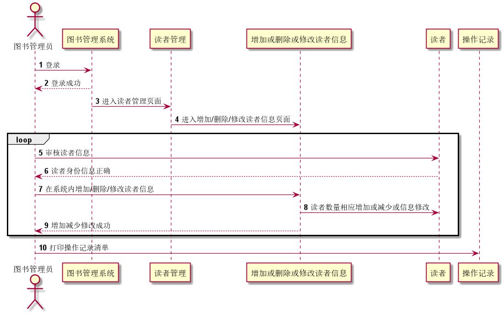

# 实验4：图书管理系统顺序图绘制
班级：17软工2班    学号：201710414204   姓名：何娟
## 图书管理系统的顺序图
### 1.借书用例
#### 1.1 借书用例PlantUml代码
<pre>
<code>
@startuml
autonumber
actor 图书管理员
图书管理员->图书管理系统:登录
图书管理系统-->图书管理员:登录成功
图书管理系统->借书页面:进入借书页面
借书页面->用户:输入读者信息
用户-->借书页面:读者信息真实且可借书
loop 至多20次
借书页面->图书:输入书籍信息
图书-->借书页面:该书可借
图书管理员->图书:借出图书，该书数量减一
图书管理员->借书记录:创建借书记录
end
图书管理员->借书记录:打印借书清单
@enduml
</code>
</pre>
#### 1.2 顺序图如下：

#### 1.3 借书用例顺序图说明：
 
1.图书管理员使用身份信息登录进入图书管理系统。         

2.系统回消息给图书管理员，表示登录成功。  
3.图书管理员从图书管理系统内在进入借书管理页面。  
4.图书管理员在借书页面输入读者提供的信息，获取到读者的更多信息。  
5.读者信息页面反馈该读者的更多信息，是否可以再次借书。  
6.再确认读者信息之后，图书管理员在借书页面输入书籍的相关信息到图书信息内。  
7.图书信息反馈相应的书籍信息以及该书是否未可借书籍。  
8.若图书信息反馈为可借书籍，则图书管理员借出书籍，系统内该书的数量减一。   
9.图书管理员针对单次的借书记录进行创建。  
10.由于6，7，8，9操作可循环进行，所以在所有操作完成后，图书管理员可打印出本次借书的所有操作记录。  
 
### 2.还书用例
#### 2.1 还书用例PlantUml代码
源码如下：
<pre>
<code>
@startuml
autonumber
actor 图书管理员
图书管理员->图书管理系统:登录
图书管理系统-->图书管理员:登录成功
图书管理系统->还书页面:进入还书页面
还书页面->用户:输入读者信息
用户-->还书页面:读者信息真实且存在未还记录
loop 至多20次
还书页面->图书:录入书籍信息
图书-->还书页面:该书状态为未还且未超期
图书管理员->图书:归还图书，书籍数量加一
图书-->还书页面:借书时间超期
用户->图书管理员:缴纳罚款
图书管理员->缴纳罚款:收取罚款并归入系统账目
缴纳罚款-->图书管理员:系统入账金额
图书管理员->还书记录:创建还书记录
end
图书管理员->还书记录:打印还书清单
@enduml
</code>
</pre>

#### 2.2 顺序图如下

#### 2.3 顺序图说明：
 
1.图书管理员使用身份信息登录进入图书管理系统。         

2.系统回消息给图书管理员，表示登录成功。  
3.图书管理员从图书管理系统内在进入还书管理页面。  
4.图书管理员在还书页面输入读者提供的信息，获取到读者的更多信息。  
5.读者信息页面反馈该读者的更多信息，是否却有未还的书籍信息。  
6.再确认读者信息之后，图书管理员在还书页面输入归还书籍的相关信息到图书信息内。  
7.图书信息反馈相应的书籍信息以及该书是否确实未还以及借书日期是否超期等信息。  
8.若图书信息反馈为未还且未超出借书日期，则图书管理员收入书籍，系统内该书的数量加一。   
9.若图书信息反馈为未还且已经超出借书日期，则要进行相应的缴纳罚款。   
10.如果借书日期超期，则读者向图书管理员缴纳相应的罚款。  
11.图书管理员收到读者缴纳的罚款之后，向系统创建罚款记录，将罚款归入系统。  
12.罚款缴纳页面反馈给图书管理员系统的收到罚款。  
13.系统确认收到罚款后，本次还书操作完成，图书管理员创建还书记录。  
14.由于6，7，8，9，10，11，12，13操作可循环进行，所以在所有操作完成后，图书管理员可打印出本次借书的所有操作记录。 
 

### 3.预约用例
#### 3.1 预约用例的PlantUml代码
<pre>
<code>
@startuml
autonumber
actor 读者
读者->图书管理系统:输入信息
图书管理系统-->读者:登录成功
图书管理系统->预约书籍:进入预约书籍页面
loop 至多20次
预约书籍->图书:输入相关书籍信息
图书-->预约书籍:该书尚有余量可预约
读者->图书:预定该书
图书->读者:成功预定，该书数量减一
图书 -->x 预约书籍:该书已无余量
图书管理系统->预约记录:创建预定记录
end
图书管理系统->预约记录:打印预定清单
@enduml
</code>
 </pre>
#### 3.2 顺序图如下：

#### 3.3 顺序图说明
 
1.读者输入身份信息进入图书管理系统。         

2.系统回消息给读者，表示登录成功。  
3.读者从图书管理系统内在进入预约书籍页面。  
4.读者进入预约界面后，输入自己想要预约的书籍信息。  
5.系统接收到读者输入的书籍信息后，返回相应的信息，例如该书是否还有余量可以预约。  
6.如返回信息为可以预约书籍，则读者即可预约书籍，其他读者便不能借走该书。  
7.预约成功后，图书对象反馈相应的信息给读者。  
8.如图书对象返回的信息为该书已无余量，不能预约，则该次的预约操作失败。   
9.在预约操作完成后，系统对象创建一个预约记录。   
10.由于6，7，8，9操作可循环进行，所以在所有操作完成后，读者可打印出本次借书的所有操作记录。 
 

### 4.图书管理用例
#### 4.1 图书管理用例PlantUml代码
<pre>
<code>
@startuml
autonumber
actor 图书管理员
图书管理员->图书管理系统:登录
图书管理系统-->图书管理员:登录成功
图书管理系统->图书管理:进入图书管理页面
图书管理->增加或删除图书:进入增加/删除图书页面
loop
图书管理员->增加或删除图书:收到新图书，并在系统内增加图书信息/删除相应图书信息
增加或删除图书-->图书管理员:图书数量增加/减少
end
图书管理员->操作记录:打印操作记录清单
@enduml
</code>
</pre>
#### 4.2 顺序图如下：

#### 4.3 顺序图说明
 
1.图书管理员使用身份信息登录进入图书管理系统。         

2.系统回消息给图书管理员，表示登录成功。  
3.图书管理员从图书管理系统内在进入图书管理页面。  
4.图书管理员从图书管理页面在进入图书的增加或删除页面。  
5.图书管理员将收到的新书信息录入系统或者要下架的旧书信息从系统中删除。  
6.图书对象在返回相应的操作给图书管理员。  
7.5，6步骤可循操作，等所有录入或删除操作完成后，便可打印一张操作记录清单。  
 
### 5.读者管理用例
#### 5.1 读者管理用例PlantUml代码
<pre>
<code>
@startuml
autonumber
actor 图书管理员
图书管理员->图书管理系统:登录
图书管理系统-->图书管理员:登录成功
图书管理系统->读者管理:进入读者管理页面
读者管理->增加或删除或修改读者信息:进入增加/删除/修改读者信息页面
loop
图书管理员->读者:审核读者信息
读者-->图书管理员:读者身份信息正确
图书管理员->增加或删除或修改读者信息:在系统内增加/删除/修改读者信息
增加或删除或修改读者信息->读者:读者数量相应增加或减少或信息修改
增加或删除或修改读者信息-->图书管理员:增加减少修改成功
end
图书管理员->操作记录:打印操作记录清单
@enduml
</code>
</pre>
#### 5.2 顺序图如下：

#### 5.3 顺序图说明:
 
1.图书管理员使用身份信息登录进入图书管理系统。         

2.系统回消息给图书管理员，表示登录成功。  
3.图书管理员从图书管理系统内在进入读者管理页面。  
4.图书管理员从图书管理页面在进入读者的增加删除和信息修改页面。  
5.图书管理员审核读者提供的身份信息，将其输入读者对象。  
6.读者对象返回给图书管理员读者的相应信息。  
7.若信息信息正确，则图书管理员向图书对象中增加读者信息。  
8.从删除或者修改读者信息页面删除或者修改对应的读者信息。   
9.返回相应的操作信息到图书管理员。  
10.由于5，6，7，8，9操作可循环进行，所以在所有操作完成后，图书管理员可打印出本次借书的所有操作记录。
 
### 6.实验心得
 
1.通过本次实验，我更加清楚明白了时序图与活动图之间的区别，时序图着重于对象之间传递消息的时间顺序，而活动图着重于描述系统的活动，判定点和分支等。         

2.从绘制时序图的过程中，我更加深入了解了图书管理系统各功能的执行顺序，功能实现逻辑，类与类之间分离与协同关系更加清楚，对真实的开发会有很大的帮助。  
3.在本次实验中我同时知道了，在开始一个项目的初期，最好是能把系统的功能描述的尽量详尽，这样到后期就不会出现功能实现模糊的情况。  

 