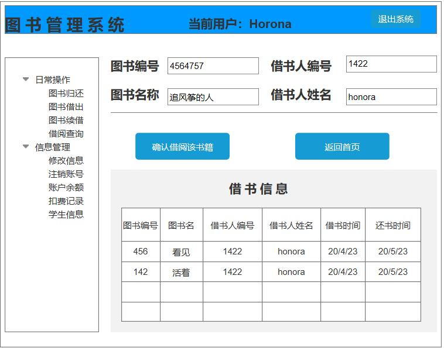

# 实验4：图书管理系统数据库设计与界面设计
班级：17软工2班   学号：201710414204   姓名：何娟
### 1.数据库表设计
#### 1.1 图书表

| 字段 | 类型 | 主键，外键 | 可以为空 | 默认值 | 约束 | 说明 |
| ------ | ------| ------ | ------| ------ | ------ | ----- |
| book_name | String |  | 否 |  |  | 书籍名称 |
| book_id | String | 主键| 否 |  | 外键 | 书籍编号 |
| author | String |  | 是 |  |  |书籍作者  |
| borrowed | Borrow | | 否 |可借  |  | 该书是否可借 |
| ISBN | String |  | 否 |  |  | |
| money | Float |  | 是 |  |  | 书籍价格 |
| type | String |  | 是 |  |  | 书籍类型 |
| reservated | Reservated |  | 是 |  |  | 该书是否被预约 |
 #### 1.2 用户表
 
 | 字段 | 类型 | 主键，外键 | 可以为空 | 默认值 | 约束 | 说明 |
| ------ | ------| ------ | ------| ------ | ------ | ----- |
| user_id | Int | 主键| 否 |  |  | 用户编号 |
| user_class | Int |  | 否 |  |  |  区分用户角色|
| user_name | String |  | 否 |  |  | 用户姓名 |
| password | String | | 否 |  |  | 用户密码 |
| sex | String |  | 是 |  |  |  用户性别|
| age | Int |  | 是 |  |  | 用户年龄 |

#### 1.3 读者表

| 字段 | 类型 | 主键，外键 | 可以为空 | 默认值 | 约束 | 说明 |
| ------ | ------| ------ | ------| ------ | ------ | ----- |
| age | Int | 主键 | 是 |  |  | 读者年龄（普通读者） |
| grade | Int | | 是 |  |  |  |
| major | String |  | 是 |  |  |  读者专业|
| borrowed_book | Int |  | 否 |  |  | 已借书籍|
 #### 1.4 图书管理员表
 
 | 字段 | 类型 | 主键，外键 | 可以为空 | 默认值 | 约束 | 说明 |
| ------ | ------| ------ | ------| ------ | ------ | ----- |
| salary | Float |  | 否 | 0.0 |  |管理员工资  |
| salary_id | Int | 主键| 否 |  |  |  管理员编号|
| work_time | String |  | 否 |  |  | 工作时间 |
| job_time | String | | 否 |  |  | 入职时间 |

#### 1.5 系统管理员表

| 字段 | 类型 | 主键，外键 | 可以为空 | 默认值 | 约束 | 说明 |
| ------ | ------| ------ | ------| ------ | ------ | ----- |
| salary | Float |  | 否| 0.0|  |工资  |
| salary_id | Int | 主键  | 否 | | | 编号 |
| log_times | Int |  | 是 |  |  | 登录次数|
#### 1.6 借书表

| 字段 | 类型 | 主键，外键 | 可以为空 | 默认值 | 约束 | 说明 |
| ------ | ------| ------ | ------| ------ | ------ | ----- |
| book_id | Int |  外键| 否|  |  | 书籍编号 |
| user_id | Int | 外键 | 否 |  |  | 读者编号 |
| user_name | String |  | 否 |  |  | 读者姓名 |
| book_name | String |  | 否 |  |  |书籍名称  |
| ISBN | String |  | 否 |  |  |  |
| time | Date |  | 否 |  |  | 借出时间 |
#### 1.7 预约表

| 字段 | 类型 | 主键，外键 | 可以为空 | 默认值 | 约束 | 说明 |
| ------ | ------| ------ | ------| ------ | ------ | ----- |
| book_id | Int |  外键| 否|  |  | 书籍编号 |
| user_id | Int | 外键 | 否 |  |  | 读者编号 |
| user_name | String |  | 否 |  |  | 读者姓名 |
| book_name | String |  | 否 |  |  |书籍名称  |
| ISBN | String |  | 否 |  |  |  |
| res_time | Date |  | 否 |  |  | 预约时间 |
#### 1.8 还书表
| 字段 | 类型 | 主键，外键 | 可以为空 | 默认值 | 约束 | 说明 |
| ------ | ------| ------ | ------| ------ | ------ | ----- |
| book_id | Int |  外键| 否|  |  | 书籍编号 |
| user_id | Int | 外键 | 否 |  |  | 读者编号 |
| user_name | String |  | 否 |  |  | 读者姓名 |
| book_name | String |  | 否 |  |  |书籍名称  |
| ISBN | String |  | 否 |  |  |  |
| ret_time | Date |  | 否 |  |  |  还书时间|
| money | Float |  | 是 |  0.0|  | 罚款金额 |

### 2.界面设计
#### 2.1 借书界面设计

- 用例图参见：借书用例
- 类图参见：借书类，读者类
- 顺序图参见：借书顺序图
- API接口如下：
 1. 获取图书信息API
- 功能：获取将要借阅的图书信息
- 请求地址：https://api.bookmanage.com/v1/books
- 请求方法：POST
- 请求参数：

|参数名称|必填|说明|
| ----- | ----- | ------|
|book_id|是|获取书籍在图书馆的编号|
|bookname|是|确定书籍的名称|

 2 获取读者信息API
- 功能：获取借阅者的信息
- 请求地址：https://api.bookmanage.com/v1/users
- 请求方法：POST
- 请求参数：

|参数名称|必填|说明|
| ----- | ----- | ------|
|user_id|是|确定读者的编号是否符合借阅条件|
|username|是|确定读者的姓名信息|

3 借阅书籍API
- 功能：将读者信息与书籍信息连接起来，确定借书
- 请求地址：https://api.bookmanage.com/v1/infos
- 请求方法：POST
- 请求参数：

|参数名称|必填|说明|
| ----- | ----- | ------|
|user_id|是|确定读者的编号是否符合借阅条件|
|username|是|确定读者的姓名信息|
|book_id|是|获取书籍在图书馆的编号|
|bookname|是|确定书籍的名称|
- 返回实例：
<pre>
<code>
{
    "info": "借书成功",
    "data": {
        "username": "honora",
        "user_id": "1422",
        "bookname": "追风筝的人",
        "book_id": "4564757",
    },
    "code": 200
}
</code>
</pre>
- 返回参数说明：

|参数名称|说明|
| ----- | ----- |
|info|返回给用户的信息|
|data|借书的联系信息|
|code|返回码|
### 3.原型图设计链接
https://eternity-hj.github.io/is_analysis_pages/test5/ui/start.html#g=1&p=index

### 4.实验心得
1 通过本次实验，我学习了Auxre原型设计的方法，学习这个软件可以方便快捷的绘制出我们想要产品原型，对于以后的产品设计阶段会有很大的帮助。     
2 同时学习到了API接口设计的思想，通过这个学习更加深刻理解了API的原理，以及该如何设计页面的API才更加合理。   
3 在做完整个实验后，对于图书管理系统的前端设计与后台设计以及数据库的设计都有一定的理解。深刻认识到了前端到后台之间是相互联系的而不是相互分离的，前端获取的数据是后台的重要部分，而后端的设计是前端的规范。
 

