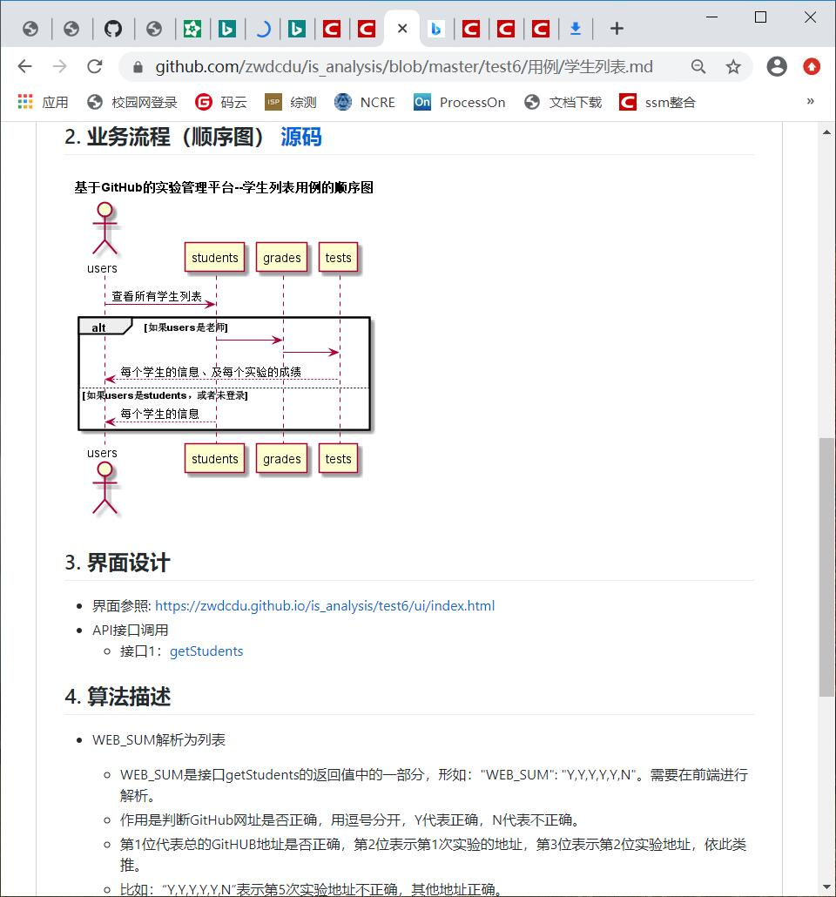

# 基于GitHub的实验管理平台的分析与设计
#### 成都大学信息科学与工程学院
学号：201710414204 班级：17软工2班 姓名：何娟
剩下大概用例图和界面设计以及接口设计
##  1.概述
- 基于GitHub的实验管理平台的作用是在线管理学生的实验成绩的Web应用系统。
- 学生的功能：选择课程，查看成绩，修改密码，修改信息，
- 老师的功能：批改每个学生成绩，查看每个学生的成绩，管理自己所开课程。
- 通过该平台可以实现老师学生之间双向协作，老师可以通过该平台管理自己所开所有课程的所有实验，学生端可以通过平台查看自己所学所有课程
的所有实验成绩。
- 满分100，最低分0分，老师批改作业时的评分项分为多项，从各个方面给学生打分有平台最终计算得出本次实验的平均成绩。
- 需要实现三双

## 2.系统总体结构

界面设计参见（主界面？）

## 3.用例图设计 [源码](puml/用例图.puml)

## 4.类图设计（plantuml设计源码）[源码](puml/类图.puml)

## 5.数据库设计
- [数据库详细设计](用例/数据库设计.md)

## 6.用例及界面详细设计
- [“修改个人信息”用例](用例/修改个人信息.md)，[界面](https://eternity-hj.github.io/is_analysis_pages/test6/ui/start.html#g=1&p=%E4%BF%AE%E6%94%B9%E4%B8%AA%E4%BA%BA%E4%BF%A1%E6%81%AF)
-[“修改密码”用例](用例/修改密码.md),[界面](https://eternity-hj.github.io/is_analysis_pages/test6/ui/start.html#g=1&p=%E4%BF%AE%E6%94%B9%E5%AF%86%E7%A0%81)
- [“开课选择”用例](用例/开课选择.md)，[开课基本界面](https://eternity-hj.github.io/is_analysis_pages/test6/ui/start.html#g=1&p=%E8%80%81%E5%B8%88%E5%BC%80%E8%AF%BE%E9%80%89%E6%8B%A9) [开课具体界面](https://eternity-hj.github.io/is_analysis_pages/test6/ui/start.html#g=1&p=%E6%B7%BB%E5%8A%A0%E8%AF%BE%E7%A8%8B)
- [“批改实验”用例](用例/批改实验.md)，[界面](https://eternity-hj.github.io/is_analysis_pages/test6/ui/start.html#g=1&p=%E6%89%B9%E6%94%B9%E6%88%90%E7%BB%A9%E9%A1%B5%E9%9D%A2)
- [“查看成绩及批语”用例](用例/查看成绩及批语.md)，[界面](https://eternity-hj.github.io/is_analysis_pages/test6/ui/start.html#g=1&p=%E6%9F%A5%E7%9C%8B%E6%88%90%E7%BB%A9%E5%8F%8A%E6%89%B9%E8%AF%AD)
- [“登出”用例](用例/登出.md)，[界面](https://eternity-hj.github.io/is_analysis_pages/test6/ui/start.html#g=1&p=%E7%99%BB%E5%BD%95%E9%A1%B5%E9%9D%A2)
- [“登录”用例](用例/登录.md)，[界面](https://eternity-hj.github.io/is_analysis_pages/test6/ui/start.html#g=1&p=%E7%99%BB%E5%BD%95%E9%A1%B5%E9%9D%A2),[学生登录首页](https://eternity-hj.github.io/is_analysis_pages/test6/ui/start.html#g=1&p=%E5%AD%A6%E7%94%9F%E7%99%BB%E5%BD%95%E9%A6%96%E9%A1%B5),[教师登录界面](https://eternity-hj.github.io/is_analysis_pages/test6/ui/start.html#g=1&p=%E8%80%81%E5%B8%88%E5%BC%80%E8%AF%BE%E9%80%89%E6%8B%A9)
- [“选择课程”用例](用例/选择课程.md)，[界面](https://eternity-hj.github.io/is_analysis_pages/test6/ui/start.html#g=1&p=%E5%AD%A6%E7%94%9F%E9%80%89%E8%AF%BE%E6%93%8D%E4%BD%9C)

